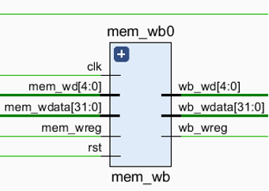
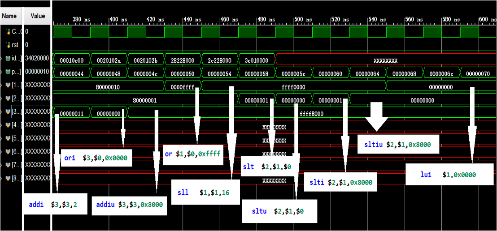

# NCUT_MiniSys
A simple MIPS five-stage pipeline CPU implements 31 MIPS instructions.  
一个简单的MIPS五级流水CPU，实现了31条指令。

Implemented according to *自己动手写CPU* by 雷思磊.  
根据雷思磊的《自己动手写CPU》实现。

Time: 2020 Summer

## Five-stage pipeline 五级流水
fetch -> decode -> execute -> memory access -> write back  
取指 -> 译码 -> 执行 -> 访存 -> 回写

## Instructions 指令
1. `add`  
    (rd) <- (rs) + (rt); rs = $2, rt = $3, rd = $1  
    op(6, 31-26): 000000, rs(5, 25-21), rt(5, 20-16), rd(5, 15-11), shamt(5, 10-6): 00000, func(6, 5-0): 100000  
    Register Direct Addressing 寄存器直接寻址
2. `addu`  
    (rd) <- (rs) + (rt); rs = $2, rt = $3, rd = $1, Unsigned number 无符号数  
    op(6, 31-26): 000000, rs(5, 25-21), rt(5, 20-16), rd(5, 15-11), shamt(510-6): 00000, func(6, 5-0): 100001  
    Register Direct Addressing 寄存器直接寻址
3. `sub`  
    (rd) <- (rs) - (rt); rs = $2, rt = $3, rd = $1  
    op(6, 31-26): 000000, rs(5, 25-21), rt(5, 20-16), rd(5, 15-11), shamt(5, 10-6): 00000, func(6, 5-0): 100010  
    Register Direct Addressing 寄存器直接寻址
4. `subu`  
    (rd) <- (rs) - (rt); rs = $2, rt = $3, rd = $1, Unsigned number 无符号数  
    op(6, 31-26): 000000, rs(5, 25-21), rt(5, 20-16), rd(5, 15-11), shamt(5, 10-6): 00000, func(6, 5-0): 100011  
    Register Direct Addressing 寄存器直接寻址
5. `and`  
    (rd) <- (rs) & (rt); rs = $2, rt = $3, rd = $1  
    op(6, 31-26): 000000, rs(5, 25-21), rt(5, 20-16), rd(5, 15-11), shamt(5, 10-6): 00000, func(6, 5-0): 100100  
    Register Direct Addressing 寄存器直接寻址
6. `or`  
    (rd) <- (rs) | (rt); rs = $2, rt = $3, rd = $1  
    op(6, 31-26): 000000, rs(5, 25-21), rt(5, 20-16), rd(5, 15-11), shamt(5, 10-6): 00000, func(6, 5-0): 100101  
    Register Direct Addressing 寄存器直接寻址
7. `xor`  
    (rd) <- (rs) ^ (rt); rs = $2, rt = $3, rd = $1  
    op(6, 31-26): 000000, rs(5, 25-21), rt(5, 20-16), rd(5, 15-11), shamt(5, 10-6): 00000, func(6, 5-0): 100110  
    Register Direct Addressing 寄存器直接寻址
8. `nor`  
    (rd) <- ~((rs) | (rt)); rs = $2, rt = $3, rd = $1  
    op(6, 31-26): 000000, rs(5, 25-21), rt(5, 20-16), rd(5, 15-11), shamt(5, 10-6): 00000, func(6, 5-0): 100111  
    Register Direct Addressing 寄存器直接寻址
9. `slt`  
    if (rs < rt) rd = 1 else rd = 0; rs＝$2, rt = $3, rd = $1  
    op(6, 31-26): 000000, rs(5, 25-21), rt(5, 20-16), rd(5, 15-11), shamt(5, 10-6): 00000, func(6, 5-0): 101010  
    Register Direct Addressing 寄存器直接寻址
10. `sltu`  
    if (rs < rt) rd = 1 else rd = 0; rs＝$2, rt = $3, rd = $1, Unsigned number 无符号数  
    op(6, 31-26): 000000, rs(5, 25-21), rt(5, 20-16), rd(5, 15-11), shamt(5, 10-6): 00000, func(6, 5-0): 101011  
    Register Direct Addressing 寄存器直接寻址
11. `sll`  
    (rd) <- (rt) << shamt, rt = $2, rd = $1  
    op(6, 31-26): 000000, rs(5, 25-21): 00000, rt(5, 20-16), rd(5, 15-11), shamt(5, 10-6), func(6, 5-0): 000000  
    Register Direct Addressing 寄存器直接寻址
12. `srl`  
    (rd) <- (rt) >> shamt, rt = $2, rd = $1  
    op(6, 31-26): 000000, rs(5, 25-21): 00000, rt(5, 20-16), rd(5, 15-11), shamt(5, 10-6), func(6, 5-0): 000010  
    Register Direct Addressing 寄存器直接寻址
13. `sra`  
    (rd) <- (rt) >> shamt, rt = $2, rd = $1, Arithmetic right shift 算数右移  
    op(6, 31-26): 000000, rs(5, 25-21): 00000, rt(5, 20-16), rd(5, 15-11), shamt(5, 10-6), func(6, 5-0): 000011  
    Register Direct Addressing 寄存器直接寻址
14. `sllv`  
    (rd) <- (rt) << (rs), rs = $3, rt = $2, rd = $1  
    op(6, 31-26): 000000, rs(5, 25-21), rt(5, 20-16), rd(5, 15-11), shamt(5, 10-6): 00000, func(6, 5-0): 000100  
    Register Direct Addressing 寄存器直接寻址
15. `srlv`  
    (rd) <- (rt) >> (rs), rs = $3, rt = $2, rd = $1  
    op(6, 31-26): 000000, rs(5, 25-21), rt(5, 20-16), rd(5, 15-11), shamt(5, 10-6): 00000, func(6, 5-0): 000110  
    Register Direct Addressing 寄存器直接寻址
16. `srav`  
    (rd) <- (rt) >> (rs), rs = $3, rt = $2, rd = $1  
    op(6, 31-26): 000000, rs(5, 25-21), rt(5, 20-16), rd(5, 15-11), shamt(5, 10-6): 00000, func(6, 5-0): 000111  
    Register Direct Addressing 寄存器直接寻址
17. `jr`  
    (PC) <- (rs)  
    op(6, 31-26): 000000, rs(5, 25-21), rt(5, 20-16): 00000, rd(5, 15-11): 00000, shamt(5, 10-6): 00000, func(6, 5-0): 001000  
    Register Direct Addressing 寄存器直接寻址
18. `addi`  
    (rt) <- (rs) + (sign-extend)immediate, rt = $1, rs = $2  
    op(6, 31-26): 001000, rs(5, 25-21), rt(5, 20-16), immediate(16, 15-0)  
    Immediate addressing 立即数寻址
19. `addiu`  
    (rt) <- (rs) + (sign-extend)immediate, rt = $1, rs = $2  
    op(6, 31-26): 001001, rs(5, 25-21), rt(5, 20-16), immediate(16, 15-0)  
    Immediate addressing 立即数寻址
20. `andi`  
    (rt) <- (rs) & (zero-extend)immediate, rt = $1, rs = $2  
    op(6, 31-26): 001100, rs(5, 25-21), rt(5, 20-16), immediate(16, 15-0)  
    Immediate addressing 立即数寻址
21. `ori`  
    (rt) <- (rs) | (zero-extend)immediate, rt = $1, rs = $2  
    op(6, 31-26): 001101, rs(5, 25-21), rt(5, 20-16), immediate(16, 15-0)  
    Immediate addressing 立即数寻址
22. `xori`  
    (rt) <- (rs) ^ (zero-extend)immediate, rt = $1, rs = $2  
    op(6, 31-26): 001000, rs(5, 25-21), rt(5, 20-16), immediate(16, 15-0)  
    Immediate addressing 立即数寻址
23. `lui`  
    (rt) <- immediate << 16 & 0FFFF0000H  
    op(6, 31-26): 001111, rs(5, 25-21): 00000, rt(5, 20-16), immediate(16, 15-0)  
    Immediate addressing 立即数寻址
24. `lw`  
    (rt) <- Memory[(rs) + (sign-extend)offset], rt = $1, rs = $2  
    op(6, 31-26): 100011, rs(5, 25-21), rt(5, 20-16), offset(16, 15-0)  
    Base addressing 基址寻址
25. `sw`  
    Memory[(rs) + (sign-extend)offset] <- (rt), rt = $1, rs = $2  
    op(6, 31-26): 101011, rs(5, 25-21), rt(5, 20-16), offset(16, 15-0)  
    Base addressing 基址寻址
26. `beq`  
    if ((rt) = (rs)) then (PC) <- (PC) + 4 + ((Sign-Extend)offset << 2), rs = $1, rt = $2  
    op(6, 31-26): 000100, rs(5, 25-21), rt(5, 20-16), offset(16, 15-0)  
    PC relative addressing PC相对寻址
27. `bne`  
    if ((rt) != (rs)) then (PC) <- (PC) + 4 + ((Sign-Extend)offset << 2), rs = $1, rt = $2  
    op(6, 31-26): 000101, rs(5, 25-21), rt(5, 20-16), offset(16, 15-0)  
    PC relative addressing PC相对寻址
28. `slti`  
    if ((rs) < (Sign-Extend)immediate) then (rt) <- 1; else (rt) <- 0, rs = $2, rt = $1  
    op(6, 31-26): 001010, rs(5, 25-21), rt(5, 20-16), immediate(16, 15-0)  
    Immediate addressing 立即数寻址
29. `sltiu`  
    if ((rs) < (Zero-Extend)immediate) then (rt) <- 1; else (rt) <- 0, rs = $2, rt = $1  
    op(6, 31-26): 001011, rs(5, 25-21), rt(5, 20-16), immediate(16, 15-0)  
    Immediate addressing 立即数寻址
30. `j`  
    (PC) <- ((Zero-Extend)address << 2), address = 10000/4  
    op(6, 31-26): 000010,  address(16, 15-0)  
    Direct addressing 直接寻址
31. `jal`  
    ($31) <- (PC) + 4; (PC) <- ((Zero-Extend)address << 2), address = 10000/4  
    op(6, 31-26): 000011,  address(16, 15-0)  
    Direct addressing 直接寻址

## Diagrams 示意图
### Data flow 数据流

### data_ram, inst_rom, cpu

### pc_reg 取指阶段

### if_id 取指阶段

### id 译码阶段

### regfile 译码阶段

### id_ex 译码阶段

### ex 执行阶段

### ex_mem 执行阶段

### mem 访存阶段

### mem_wb 访存阶段


## Sources 源代码
`NCUT_MiniSys.v`: main  
`inst_rom.v`: Instructions ROM 指令存储器  
`data_ram.v`: Data RAM 数据存储器  
`cpu.v`: CPU  
`pc_reg.v`: PC  
`if_id.v`: fetch -> decode 取指 -> 译码  
`id.v`: decode 译码  
`regfile.v`: register 寄存器  
`id_ex.v`: decode -> execute 译码 -> 执行  
`ex.v`: execute 执行  
`ex_mem.v`: execute -> memory access 执行 —> 访存  
`mem.v`: memory access 访存  
`mem_wb.v`: memory access -> write back 访存 -> 回写

## Simulation 仿真
### and, or, xor, nor, andi, ori, xori, lui
`logic.S`
```
lui  $1,0x0101           # $1=0x01010000
ori  $1,$1,0x0101        # $1=0x01010101
ori  $2,$1,0x1100        # $2=0x01011101
or   $1,$1,$2            # $1=0x01011101
andi $3,$1,0x00fe        # $3=0x00000000
and  $1,$3,$1            # $1=0x00000000
xori $4,$1,0xff00        # $4=0x0000ff00
xor  $1,$4,$1            # $1=0x0000ff00
nor  $1,$4,$1            # $1=0xffff00ff
```

### sll, srl, sra, sllv, srlv, srav
`shift.S`
```
lui  $2,0x0404     # $2=0x04040000
ori  $2,$2,0x0404  # $2=0x04040404
ori  $7,$0,0x7     # $7=0x00000007
ori  $5,$0,0x5     # $5=0x00000005
ori  $8,$0,0x8     # $8=0x00000008
sll  $2,$2,8       # $2=0x04040400
sllv $2,$2,$7      # $2=0x02020000
srl  $2,$2,8       # $2=0x00020200
srlv $2,$2,$5      # $2=0x00001010
sll  $2,$2,19      # $2=0x80800000
sra  $2,$2,16      # $2=0xffff8080
srav $2,$2,$8      # $2=0xffffff80
```

### add, addu, sub, subu, slt, sltu, addi, addiu, slti, sltiu
`arithmetic.S`
```
ori   $1,$0,0x8000           # $1=0x00008000
sll   $1,$1,16               # $1=0x80000000
ori   $1,$1,0x0010           # $1=0x80000010
ori   $2,$0,0x8000           # $2=0x00008000
sll   $2,$2,16               # $2=0x80000000
ori   $2,$2,0x0001           # $2=0x80000001
ori   $3,$0,0x0000           # $3=0x00000000
addu  $3,$2,$1               # $3=0x00000011
ori   $3,$0,0x0000           # $3=0x00000000
add   $3,$2,$1               # $3=0x00000000, overflow
sub   $3,$1,$3               # $3=0x80000010
subu  $3,$3,$2               # $3=0x0000000f
addi  $3,$3,2                # $3=0x00000011
ori   $3,$0,0x0000           # $3=0x00000000
addiu $3,$3,0x8000           # $3=0xffff8000
or    $1,$0,0xffff           # $1=0x0000ffff
sll   $1,$1,16               # $1=0xffff0000
slt   $2,$1,$0               # $2=0x00000001
sltu  $2,$1,$0               # $2=0x00000000
slti  $2,$1,0x8000           # $2=0x00000001
sltiu $2,$1,0x8000           # $2=0x00000000
lui   $1,0x0000              # $1=0x00000000
```


### jr, j, jal
`branch.S`
```
ori  $1,$0,0x0001   # $1=0x00000001 (1)
j    0x20           # 
ori  $1,$0,0x0002   # $1=0x00000002 (2) Delay slot 延迟槽
ori  $1,$0,0x1111
ori  $1,$0,0x1100
.org 0x20
ori  $1,$0,0x0003   # $1=0x00000003 (3)
jal  0x40           #
ori  $2,$0,0x0048   # $2=0000000048 Delay slot 延迟槽
ori  $1,$0,0x0005   # $1=0x00000005 (5)
ori  $1,$0,0x0006   # $1=0x00000006 (6)
j    0x60           #
nop                 #
.org 0x40
j    0x2c           #
or   $1,$2,$0       # $1=0x0000048 (4) Delay slot 延迟槽
ori  $1,$0,0x0009   # $1=0x0000009 (9)
ori  $1,$0,0x000a   # $1=0x000000a (10)
j    0x80           #
nop
.org 0x60
ori  $1,$0,0x0007   # $1=0x00000007 (7)
jr   $2             #
ori  $1,$0,0x0008   # $1=0x00000008 (8) Delay slot 延迟槽
ori  $1,$0,0x1111
ori  $1,$0,0x1100
.org 0x80
```


### beq, bne
`branch2.S`
```
ori $1,$0,0x0001   # $1=0x00000001
beq $0,$1,0x0002   #
beq $0,$0,0x0002   #
ori $2,$0,0x0001   # $2=0x00000001 Delay slot 延迟槽
ori $3,$0,0x0001
ori $4,$0,0x0001   # $4=0x00000001
ori $1,$0,0xffff   # $1=0x0000ffff
bne $0,$0,0x0002   #
bne $0,$1,0x0002   #
ori $3,$0,0xffff   # $3=0x0000ffff Delay slot 延迟槽
ori $2,$0,0xffff
ori $4,$0,0xffff   # $4=0x0000ffff
```

### lw, sw
`store_load.S`
```
ori $3,$0,0xeeff   # $3=0x0000eeff
sw  $3,0x8($0)     #
lw  $1,0x8($0)     # $1=0x0000eeff
lw  $2,0x8($0)     # $2=0x0000eeff
```
